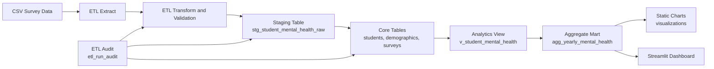

# Student Mental Health Analytics Engineering Project

I built an analytics pipeline for student mental health survey analysis using a layered data architecture:
- **Ingestion and ETL:** CSV to staging with validation, logging, and idempotent upserts.
- **Core Data Model:** normalized MySQL schema with PK/FK constraints and quality guards.
- **Analytics Layer:** SQL views, KPI marts, and window-function based trend analysis.
- **Consumption Layer:** Python static visualizations and Streamlit dashboard for decision-making.

The project focuses on strong fundamentals: data integrity, reproducibility, query performance, and business-facing metrics.

---

## 2. Tech Stack

- MySQL 8+
- Python 3.10+
- Pandas
- mysql-connector-python
- Matplotlib + Seaborn
- Streamlit + Plotly
- Pytest

---

## 3. Architecture Diagram



---

## 4. Project Structure

```text
project/
¦
+-- config/
¦   +-- settings.py
¦   +-- logger.py
¦
+-- etl/
¦   +-- extract.py
¦   +-- transform.py
¦   +-- load.py
¦
+-- sql/
¦   +-- 01_schema.sql
¦   +-- 02_indexes.sql
¦   +-- 03_analytics.sql
¦   +-- 04_data_quality_checks.sql
¦
+-- dashboard/
¦   +-- app.py
+-- visualizations/
¦   +-- build_charts.py
+-- tests/
¦   +-- test_transform.py
+-- run_etl.py
+-- requirements.txt
+-- .env.example
```

Why this structure is better:
- **Separation of concerns:** extraction, transformation, loading, modeling, analytics, and presentation are isolated.
- **Maintainability:** easier debugging and targeted updates.
- **Scalability:** ready for orchestration and scheduled refresh workflows.

---

## 5. Data Model

### Core Tables

1. `students`
- Grain: one row per student record hash.
- Keys: `student_id` (PK), `record_hash` (UNIQUE).

2. `demographics`
- Grain: one row per student.
- Keys: `student_id` (PK/FK to students).

3. `surveys`
- Grain: one survey response per student per timestamp.
- Keys: `survey_id` (PK), unique key `(student_id, survey_date)`.

### Staging and Metadata

4. `stg_student_mental_health_raw`
- Raw cleaned landing table with constraints and ingestion timestamp.

5. `etl_run_audit`
- ETL observability: status, start/end time, row counts, error message.

### Analytics Layer

6. `v_student_mental_health`
- Reusable analysis view joining core entities.

7. `agg_yearly_mental_health`
- Materialized-style aggregate table for fast dashboard reads.

---

## 6. ETL Design (Production-Aware)

Implemented capabilities:
- Environment-based secrets (`.env` + `config/settings.py`)
- Structured rotating logs (`logs/etl.log`)
- Input schema validation
- Data-domain validation (age bounds, binary flags)
- Idempotent loading (`record_hash` + upsert)
- Incremental insertion into `surveys` using anti-join
- ETL run metadata and failure capture
- Batched inserts via `executemany`

---

## 7. SQL Analytics Highlights

- KPI prevalence metrics by year of study
- Conditional aggregation by gender/treatment
- Window functions:
  - rolling 3-point moving average
  - year-over-year delta with `LAG`
  - risk ranking via `DENSE_RANK`
- Aggregate refresh query for `agg_yearly_mental_health`
- `EXPLAIN FORMAT=TREE` pattern for optimization review

---

## 8. Data Quality Checks

`sql/04_data_quality_checks.sql` includes:
- Null checks on critical dimensions
- Binary domain checks
- Referential integrity orphan checks
- Freshness (ingestion latency hours)
- Duplicate grain checks

---

## 9. Runbook

## 9.1 Prerequisites

1. Install Python dependencies:
```bash
pip install -r requirements.txt
```

2. Create `.env` from template:
```bash
cp .env.example .env
```
On Windows PowerShell:
```powershell
Copy-Item .env.example .env
```

3. Update `.env` with your MySQL credentials.

## 9.2 Database Setup

Run in order:
1. `sql/01_schema.sql`
2. `sql/02_indexes.sql`
3. `sql/03_analytics.sql`
4. `sql/04_data_quality_checks.sql`

## 9.3 Run ETL

```bash
python run_etl.py
```

## 9.4 Build Charts

```bash
python visualizations/build_charts.py
```

## 9.5 Launch Dashboard

```bash
streamlit run dashboard/app.py
```

## 9.6 Run Tests

```bash
pytest -q
```

---

## 10. Indexing Strategy

Key indexes:
- `surveys(student_id, survey_date)` for grain uniqueness and lookup.
- `surveys(year_of_study, sought_treatment)` for analytics filtering/grouping.
- `demographics(gender, program_of_study)` for segmentation.
- `stg_student_mental_health_raw(ingestion_ts)` for freshness checks.

Tradeoff: read performance improves, writes become slightly heavier.

---

## 11. Business Value

University decision support use-cases:
- Identify high-risk student cohorts by year/program/gender.
- Track treatment uptake and mental-health prevalence trends.
- Prioritize outreach and counseling capacity planning.

Suggested KPIs:
- anxiety/depression/panic prevalence (%)
- treatment uptake (%)
- composite risk index by program
- year-over-year changes

---

## 12. Known Limitations

- Dataset is small (about 100 rows), so statistical confidence is limited.
- Survey data is observational; avoid causal claims.
- Current project is single-source CSV; multi-source integration is future work.

---

## 13. Realistic Next Steps

1. Add retry with exponential backoff for DB connectivity.
2. Add CI workflow (lint + tests + SQL checks).
3. Add Docker Compose for reproducible local setup.
4. Add Power BI connector to `agg_yearly_mental_health`.
5. Add basic FastAPI endpoint for serving KPIs.

---
> Built an end-to-end analytics engineering pipeline with idempotent ETL, normalized modeling, indexed SQL analytics, quality checks, and dashboard-ready KPI marts for student mental health trend analysis.
